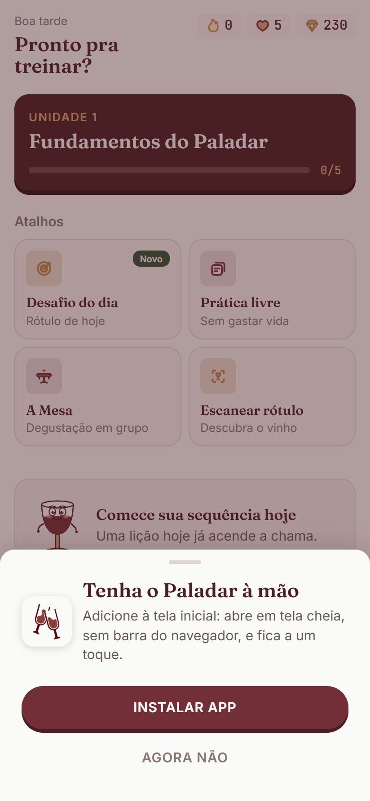
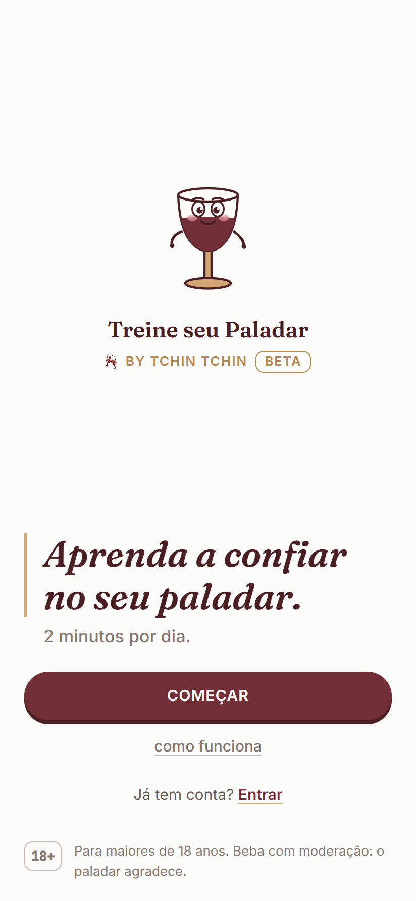
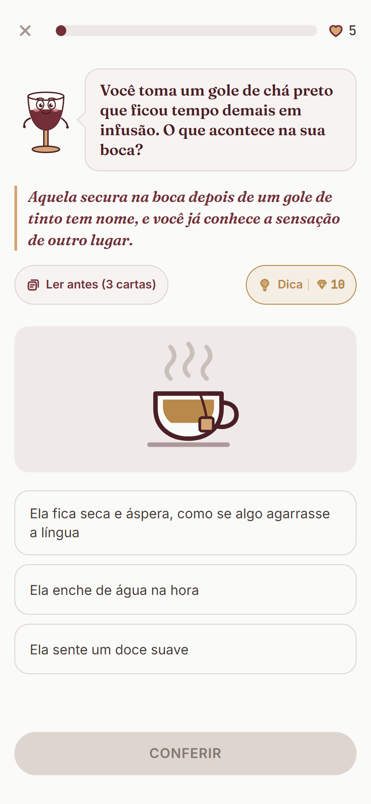
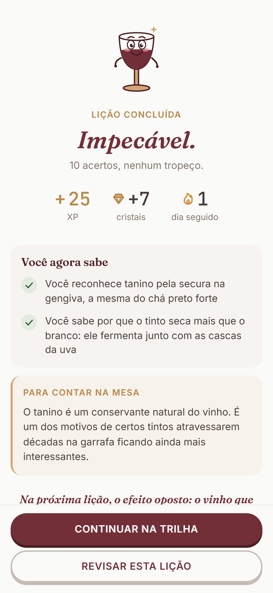
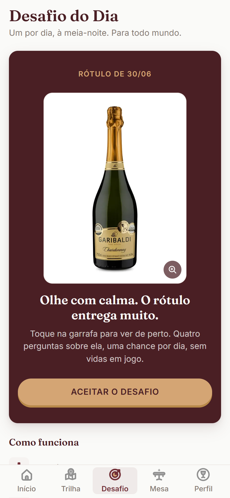
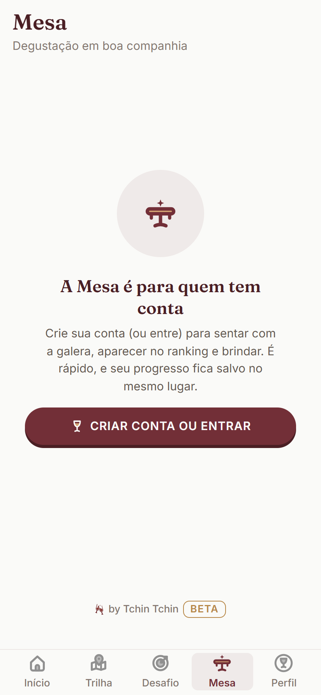
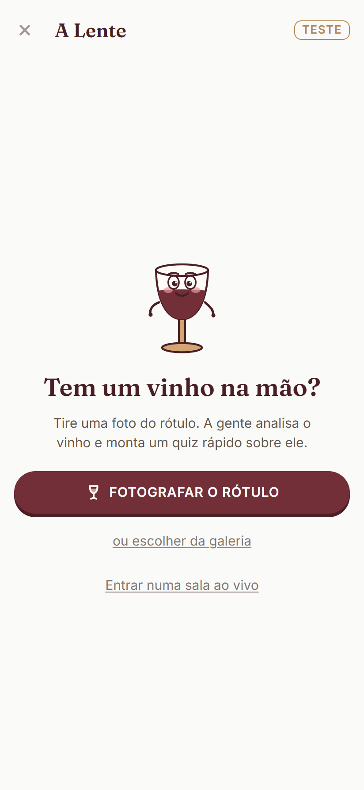
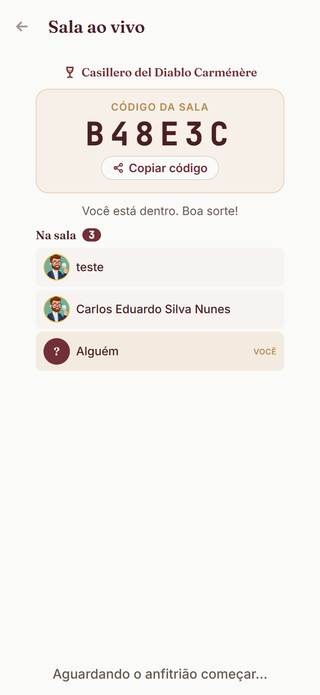
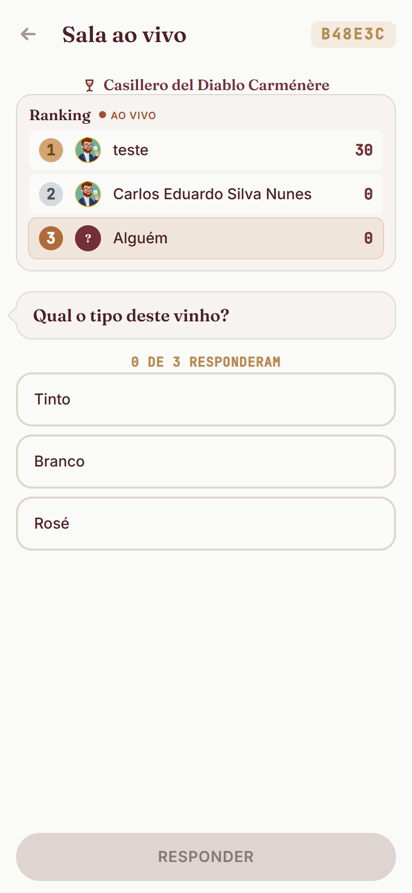
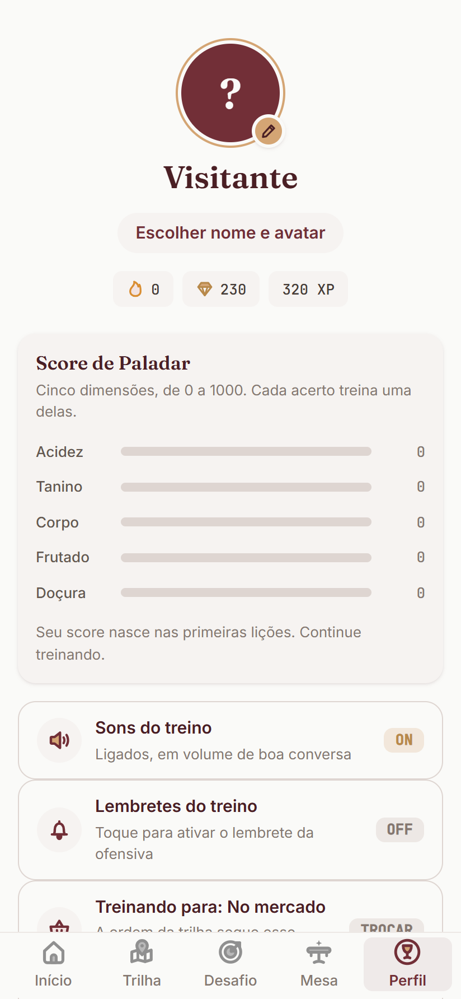

# Treine seu Paladar — Guia de Funcionalidades (para teste)

**O que é:** um app no estilo "Duolingo do vinho" — treino diário, curto e divertido, para a pessoa aprender a escolher e entender vinho com confiança. Lições de 2 minutos, sem aula chata, com um mascote que guia o caminho. Público: 35 a 54 anos, a maioria iniciante em vinho.

> Há uma versão deste guia em **Word** (`Guia-Treine-seu-Paladar.docx`) na mesma pasta, pronta para enviar.

---

## Como acessar e instalar

- **Link:** https://paladar.tchintchin.com.br
- **Funciona direto no navegador** do celular ou computador.
- **Dá para instalar como app (recomendado para testar):**
  - **Android (Chrome):** menu (3 pontinhos) → "Adicionar à tela inicial" / "Instalar app".
  - **iPhone (Safari):** botão Compartilhar → "Adicionar à Tela de Início".
- **Maiores de 18:** na primeira vez, é preciso aceitar os Termos e a Política de Privacidade para entrar.

---

## Funcionalidades principais

### 1. Primeiro acesso (onboarding)
Uma abertura curta com o mascote e a **primeira lição-tutorial**: em poucos toques a pessoa já está acertando perguntas e ganhando os primeiros pontos. No fim, escolhe a meta diária.

- **Como testar:** abra o app pela primeira vez (ou em uma aba anônima) e siga o fluxo "Começar".

### 2. Trilha de lições (o coração do app)
Uma trilha de unidades e lições, no estilo de um joguinho. Cada lição é rápida e mistura formatos (múltipla escolha, deslizar, ordenar). O progresso rende **XP** (pontos de treino), **coroas** por lição, **ofensiva** (dias seguidos) e usa **vidas**.

- **Como testar:** na aba **Início/Trilha**, toque na lição disponível e jogue até o fim. Veja o XP subir e a ofensiva acender.

 

### 3. Desafio do Dia
Um desafio novo por dia sobre um rótulo. Serve para criar o hábito de voltar todo dia.

- **Como testar:** aba **Desafio** → jogar o desafio de hoje → ver o resultado.

### 4. Prática livre
Treino à vontade, **sem gastar vidas**. Bom para quem quer revisar sem pressão.

- **Como testar:** na home, atalho **Prática livre**.

### 5. A Mesa (jogar com amigos)
Um grupo com **ranking** entre amigos. Dá para criar uma mesa, convidar por link/código e deixar privada. Precisa de conta.

- **Como testar:** aba **A Mesa** → criar uma mesa e compartilhar o convite, ou entrar em uma mesa por código. Compare a pontuação no ranking.

### 6. A Lente (escanear o rótulo)
A pessoa **tira uma foto do rótulo** de um vinho e o app monta na hora um **quiz sobre aquele vinho específico**. A câmera tem verificação ao vivo (luz, nitidez, enquadramento) e **dispara sozinha** quando a foto está boa e estável.

- **Como testar:** na home, atalho **Escanear rótulo** → apontar para o rótulo de um vinho de verdade → aguardar o disparo automático → responder o quiz que ele gera.

### 7. Sala Ao Vivo de Degustação (quiz em grupo)
O grande diferencial social: o **anfitrião escaneia um vinho**, gera um **código de sala**, e a mesa toda **entra pelo código** (cada um no seu celular). Todos respondem o **mesmo quiz juntos**, no estilo Kahoot: o certo/errado só aparece **depois que todos responderem**, e o **ranking sobe ao vivo** com o avatar de cada um. O anfitrião controla quando avançar para a próxima pergunta.

- **Como testar (precisa de 2 aparelhos):**
  1. No aparelho A, abra **Escanear rótulo**, escaneie um vinho e escolha **criar a sala ao vivo**.
  2. Compartilhe o **código** que aparece.
  3. No aparelho B, abra a Lente → **entrar numa sala ao vivo** → digite o código.
  4. No aparelho A (anfitrião), toque em **Começar o quiz** — todos começam juntos.
  5. Respondam; veja o certo/errado aparecer só quando todos responderem e o ranking ao vivo com os avatares.

 

### 8. Perfil e avatar
Cada pessoa escolhe um **avatar** (personagem) e acompanha seu **XP, ofensiva e progresso**. O avatar aparece na Mesa e na Sala Ao Vivo.

- **Como testar:** aba **Perfil** → escolher/trocar o avatar → conferir os números.

### 9. Conta (salvar o progresso)
Dá para usar tudo sem cadastro. Para **salvar o progresso e acessar de outro aparelho**, a pessoa cria conta por **e-mail** ou **Google** — o progresso feito como visitante migra para a conta.

- **Como testar:** em "Salvar seu progresso", criar conta (e-mail ou Google) e confirmar que o progresso continua.

### 10. Notificações (opcional)
Lembretes amigáveis para manter a ofensiva e avisar do desafio. A pessoa liga/desliga quando quiser.

- **Como testar:** ativar quando o app pedir, ou no **Perfil**.

---

## Roteiro de teste em ~5 minutos (sugestão)

1. Abrir https://paladar.tchintchin.com.br, aceitar os termos e fazer o **onboarding**.
2. Jogar **1 lição** completa na Trilha (sentir o ritmo e o XP).
3. Abrir o **Desafio do Dia** e responder.
4. Abrir a **Lente**, escanear um rótulo de vinho de verdade e fazer o quiz.
5. (Com 2 celulares) Testar a **Sala Ao Vivo**: criar sala em um, entrar no outro pelo código, começar e jogar juntos.
6. **Criar conta** (e-mail ou Google) e conferir se o progresso é mantido.
7. Anotar qualquer coisa estranha (ver abaixo).

---

## Como reportar bugs e feedback

Ao testar, anote sempre que possível:
- **O que você fez** (a tela e os toques).
- **O que esperava** e **o que aconteceu**.
- **Aparelho e navegador** (ex.: Android/Chrome, iPhone/Safari).
- Se der erro, um **print** ajuda muito.

> Sugestão: centralizar o feedback num grupo ou planilha única, para não se perder.

---

*Treine seu Paladar — by Tchin Tchin. Versão em teste de mercado.*
